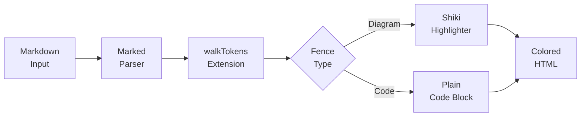

# Markdown Kitchen Sink

Test document for all markdown elements.

## Headings

### H3 Heading
#### H4 Heading
##### H5 Heading
###### H6 Heading

## Inline Code and Blocks

Inline `code` styling with `var(--color-sidebar-bg)` background.

```js
// JavaScript with syntax highlighting
function longFunctionNameThatExceedsNormalWidth() {
  return "this is a really long line that should trigger horizontal scrolling in narrow panes";
}
```

```go
// Go code with syntax highlighting
package main

import "fmt"

func main() {
  fmt.Println("Hello, World!")
}
```

```python
# Python code with syntax highlighting
def fibonacci(n):
  if n <= 1:
    return n
  return fibonacci(n-1) + fibonacci(n-2)
```

```text
Plain text fence — should render without syntax highlighting.
No colors, just plain <pre><code> output.
```

```unknown-lang
This fence uses an unknown language.
Should fall back to plain text rendering.
No syntax highlighting attempted.
```

## Tables

| Feature | Description | Status |
|---------|-------------|--------|
| Border collapse | Cell borders should render | ✓ |
| Header styling | Tinted background | ✓ |
| Horizontal scroll | Overflow handling | ✓ |
| Long cell content | Lorem ipsum dolor sit amet consectetur | ✓ |

Wide table demonstrating horizontal scrolling:

| Column 1 | Column 2 | Column 3 | Column 4 | Column 5 | Column 6 | Column 7 |
|----------|----------|----------|----------|----------|----------|----------|
| Data A | Data B | Data C | Data D | Data E | Data F | Data G |
| Long content here | More data | Additional info | Extra value | Another field | Yet another | Last one |

## Blockquote

> This is a blockquote with styled border-left.
> It should use var(--color-border) for the left border.
>
> Multiple paragraphs work too.

## Horizontal Rule

---

## Lists

### Unordered List

- Item 1
- Item 2
- Item 3
  - Nested item 3.1
  - Nested item 3.2
- Item 4

### Ordered List

1. First item
2. Second item
3. Third item
   1. Nested 3.1
   2. Nested 3.2
4. Fourth item

## Images


A paragraph after the image.

## Diagrams

### Mermaid



## Combined Elements

Here's a **bold** statement with a [link](https://example.com) and some `inline code`.

> **Note:** Blockquotes can contain other formatted text like **bold** and *italic*.
>
> - And even lists
> - Inside quotes

---

End of kitchen sink.
